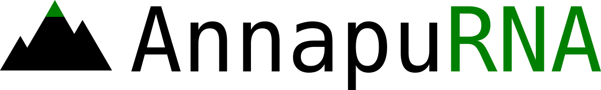
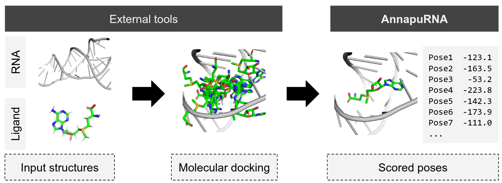
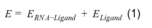
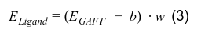
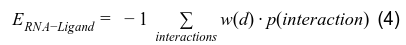
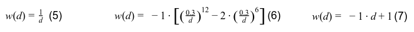

<!-- TOC START min:1 max:5 link:true asterisk:false update:true -->
- [About](#about)
- [Installation](#installation)
    - [Tests](#tests)
    - [Uninstallation](#uninstallation)
    - [Tested environments](#tested-environments)
- [Usage](#usage)
  - [Quick start](#quick-start)
  - [AnnapuRNA in action](#annapurna-in-action)
  - [AnnapuRNA in Jupyter Notebook](#annapurna-in-jupyter-notebook)
  - [Usage](#usage-1)
    - [Input files](#input-files)
        - [RNA](#rna)
        - [Ligand poses](#ligand-poses)
    - [Scoring models](#scoring-models)
    - [Clustering](#clustering)
    - [Other options](#other-options)
    - [Advanced options](#advanced-options)
    - [Program fine-tuning (advanced users only!)](#program-fine-tuning-advanced-users-only)
      - [Scoring huge docking files](#scoring-huge-docking-files)
      - [Running H2O server on another machine](#running-h2o-server-on-another-machine)
      - [Calculate the centroid of the cluster](#calculate-the-centroid-of-the-cluster)
      - [Tuning parameters of the Affinity Propagation clustering method](#tuning-parameters-of-the-affinity-propagation-clustering-method)
      - [Adding H atoms to the ligand](#adding-h-atoms-to-the-ligand)
    - [Output files](#output-files)
    - [Usage examples](#usage-examples)
  - [Docking programs](#docking-programs)
  - [Known limitations and issues](#known-limitations-and-issues)
    - [Installation](#installation-1)
- [About the name](#about-the-name)
- [Additional data](#additional-data)
- [Software used](#software-used)
- [License](#license)
- [How to cite](#how-to-cite)
- [Funding](#funding)
- [Contact](#contact)
<!-- TOC END -->


# About

**AnnapuRNA** is a knowledge-based scoring function designed to evaluate RNA-ligand complex structures, generated by any computational docking method.



# Installation

Recommended way of AnnapuRNA installation and running is via conda environment under Linux 64 bit (extensively tested on Ubuntu).

1. Install miniconda.  Please refer to [conda manual](https://docs.conda.io/projects/conda/en/latest/user-guide/install/index.html) and install conda version according to your operating system. Please use Python2 version (miniconda2).
2. Clone AnnapuRNA repository: `git clone --depth=1 git@github.com:filipsPL/annapurna.git` or [fetch a zip package](https://github.com/filipsPL/annapurna/archive/master.zip).
3. Go to the AnnapuRNA directory (typically `cd annapurna` under linux) and restore the conda environment from the yml file `conda env create -f conda-environment.yml` (the complete AnnapuRNA conda environment needs ~1.5 GB of free disk space).

### Tests

To validate the installation and run tests, please execute `annapurna-tests.sh`.

### Uninstallation

(if you no longer need the AnnapuRNA)

1. Remove the directory with the AnnapuRNA code
2. remove conda environment: `conda remove --name annapurna --all`.
3. To verify that the environment was removed, in your terminal window run `conda info --envs`

### Tested environments

AnnapuRNA was extensively tested under Linux with Ubuntu versions 16.04, 18.04, and 20.04, with latest miniconda2 `Miniconda2-py27_4.8.3-Linux-x86_64.sh`.

[](https://github.com/filipsPL/annapurna/actions?query=workflow%3A%22install+and+test%22)

[](https://github.com/filipsPL/annapurna/actions?query=workflow%3A%22Flake8+python%22)

# Usage

## Quick start

Sample input files from molecular docking are located in `tests/testFiles/`: `1AJU.pdb` - the RNA structure and `ARG.sdf` - poses from docking.

```bash
conda activate annapurna

mkdir testresults
./annapurna.py -r tests/testFiles/1AJU.pdb -l tests/testFiles/ARG.sdf -m kNN_modern -o testresults/output --groupby
```

Output files:
- Table with scores: `testresults/output.kNN_modern.csv` (scores for all poses) and `testresults/output.kNN_modern.grouped.csv` (best score for each compound from the input file). The AnnapuRNA score is in the last column ("score"). The lower value, the better.

## AnnapuRNA in action

[](https://asciinema.org/a/uaX1tcmKyQGjFhUtMtMUwbp8Z)

```bash
# commands used in the screen cast
conda activate annapurna
./annapurna.py --help
mkdir testresults
./annapurna.py -r tests/testFiles/1AJU.pdb -l tests/testFiles/ARG.sdf -m kNN_modern -o testresults/output --groupby
cd testresults
ls -la
column -t output.kNN_modern.grouped.csv
column -t output.kNN_modern.csv | less
```

## AnnapuRNA in Jupyter Notebook

To see or run AnnapuRNA in jupyter-notebook, refer to the [sample notebook](annapurna-example.ipynb) (please note that this is a notebook with a **bash** kernel).

## Usage

### Input files

##### RNA

PDB format is mandatory, with nucleotide letters assigned to atoms, eg:
```
ATOM     64  H1    G A  17      -5.322  17.506   1.537  1.00  0.00           H
ATOM     65  H21   G A  17      -5.499  17.205   3.712  1.00  0.00           H
ATOM     66  H22   G A  17      -4.319  17.828   4.843  1.00  0.00           H
ATOM     67  P     C A  18       3.269  18.622   4.974  1.00  0.00           P
ATOM     68  OP1   C A  18       3.196  20.073   5.282  1.00  0.00           O
ATOM     69  OP2   C A  18       4.574  17.923   5.091  1.00  0.00           O
ATOM     70  O5'   C A  18       2.219  17.861   5.902  1.00  0.00           O
```
pdb files fetched from the Protein Data Bank should be fine.

##### Ligand poses

AnnapuRNA accepts many file formats, such as sdf, mol2, mol, pdb, or any other [understood by the OpenBabel](http://openbabel.org/docs/current/FileFormats/Overview.html). Extensively tested on sdf files.

Remarks:
- If your input file contains more than one compound (i.e., chemical compound with unique structure), please make sure that each of compounds has an unique name/title.
- Please make sure that the ligands have the desired protonation state.

### Scoring models

:warning: *Please note, that for using Deep Learning models (ie. 'DL_basic', 'DL_modern') you should run a H2O engine in another window, by issuing the command `./start_h2o.sh`*.


AnnapuRNA was benchmarked on four different models: 'DL_basic', 'DL_modern', 'kNN_basic', and 'kNN_modern'.

kNN_modern should be a good first shot:

```bash
./annapurna.py -r tests/testFiles/1AJU.pdb -l tests/testFiles/ARG.sdf -m kNN_modern -o testresults/output --groupby
```

Please note, that you can specify scoring with more than one models in a single run:

```bash
./annapurna.py -r tests/testFiles/1AJU.pdb -l tests/testFiles/ARG.sdf -m kNN_basic -m kNN_modern -o testresults/output --groupby
```

or even all available models:

```bash
./annapurna.py -r tests/testFiles/1AJU.pdb -l tests/testFiles/ARG.sdf -m ALL -o testresults/output --groupby
```
Please pay attention to the optional argument `--merge` - which merges predictions from multiple models into a single file.

In addition to those four models, we provide two models of interactions: NB_modern (Naive Bayes) and RF_modern (Random Forests), both trained on 2016 data set (but please note, that the performance wasn't thoroughly tested).

### Clustering

The clustering of poses is optional and is based on the RMSD distance matrix. We implemented three clustering algorithms that take the RMSD distance matrix as an input, namely "AutoDock-like" method (as implemented in the AutoDock/AutoDock Vina) - **AD**, "SimRNA-like" method (as implemented in ROSETTA/SimRNA programs) - **SR**, and Affinity Propagation method (**AP**).

There are three switches defining clustering parameters:


- choosing a clustering method:

```
--clustering_method {False,AD,SR,AP}
                      Clustering method. AD = AutoDock-like; SR = SimRNA-
                      like; AP = Affinity Propagation.
```


- defining, how many of top scoring poses will be taken for clustering. 1 = all poses, 0.5 = 50% of the best poses etc.:

```
--cluster_fraction CLUSTERINGFRACTION
                      Docking poses clustering. Select this fraction of top
                      scoring poses. 0-1. 0 = do not cluster results
```


- for AD = AutoDock-like and SR = SimRNA-like clustering methods, define a clustering cut off. 2 Å should be a reasonable starting point.
```
--cluster_cutoff CLUSTERINGCUTOFF
                      Docking poses clustering. Use this RMSD cutoff for
                      clustering. 0 = do not use the RMSD cutoff
```

For examples, go to the [Usage examples](#usage-examples) section.

For fine-tuning the Affinity Propagation method, go to the [Program fine-tuning](#program-fine-tuning-advanced-users-only) section.


### Other options

- `-o OUTPUTFILENAME` - define the output file name core, eg., `-o testresults/output` will generate results in `testresults` dir, with names starting with `output`.
- `-s, --skip_statistics` - if, for a given complex (ie. RNA + ligand poses) statistics are already calculated (eg., in a previous run), these can be used directly to score poses, without need to re-calculate interactions statistics.
- `--merge` - merge predictions from multiple models into a single file. Useful when using multiple models for scoring.
- `-g, --groupby` - in addition, output scores with a single best score for each compound.


### Advanced options

Usually, there is *no need* to modify these settings.

**Ligand contribution weight term**

```
-e ENERGYWEIGHT, --weight_ligand_energy ENERGYWEIGHT
                      weight for a ligand's energy term. Default: 0.1. 0
                      (zero) = do not use the energy term.
```

The total score for RNA-Ligand complex is a sum of two terms:



The score of internal energy of ligand, E_Ligand , is derived from GAFF internal energy of the ligand and is calculated from the formula:



The ligand’s contribution to the final complex score is scaled by the weighting factor w. This parameter was set to 0.1 after optimization in a cross-validation experiment but may be changed by the user via a command-line switch `-e` or `--weight_ligand_energy`. To turn off the ligand term, set it to zero: `-e 0`.

**Distance dependent probabilities**

```
-w {False,L-J,linear,1/x,exp,x^2,log}, --weight_distance {False,L-J,linear,1/x,exp,x^2,log}
                      weight probabilities by distance depending function. False =
                      don't weight by distance (default)
```

We evaluated the performance of the scoring functions changes if a distant-dependent weights are applied to the component probability values, calculated for each of the interactions. This transformation expresses the higher contribution of the short-range interactions and lower for the more distant ones. For this purpose we introduced to equation 2 an additional distant-dependent weight factor w(d) (eq. 4):



We implemented three different transforming functions: multiplicative inverse (equation 5), Lennard-Jones-like transformation (equation 6) and linear transformation (equation 7):



By default, this is turned off.


**Distance cut off**

```
-d USEDISTANCECUTOFF, --distance_cutoff USEDISTANCECUTOFF
                      use distance cutoff. 0-10 Å. Default: 10 Å.

```

Limit the interaction sphere, for which the interactions are calculated, to a given distance. Please note, that the scoring models are trained on interactions collected for 10 Å distance.

**Probabilities transformation**

```
-t {False,PMF}, --transform_proba {False,PMF}
                      transform calculated probabilities. Default: false
```

The component probabilities can be transformed by applying PMF-like transformation (See: Potential of Mean Force See: Bernauer, RNA, 2011, 17, 1066-1075), expressed as `-1*log(p)`, where *p* is probability of interaction calculated from the ML model.

By default, this is turned off.

### Program fine-tuning (advanced users only!)

:no_pedestrians:  :no_entry: For normal use, there is no need to change settings listed below, so please modify it only if you know what you are doing  :boom:

#### Scoring huge docking files

When working with very big docking files and/or operating on hardware with limited memory, it may be necessary to adjust the chunksize parameter in the program::

`chunksize = 2000000		# adjust according to the available RAM memory`


#### Running H2O server on another machine

By default, AnnapuRNA assumes the H2O ML server is running on the same computer as AnnapuRNA is executed (i.e., the localhost, 127.0.0.1). This can be changed by editing the variable:

`h2o_ip = "127.0.0.1"`

#### Calculate the centroid of the cluster

Enabling centroid calculation for clusters - change `averageStructure` variable to `True`:

`averageStructure = False # default`


#### Tuning parameters of the Affinity Propagation clustering method

AP clustering is defined around line 991, with:

```python
af = AffinityPropagation(affinity="precomputed").fit(rmsdMatrix)
```

For the available options, refer to the [scikit-learn manual](https://scikit-learn.org/0.17/modules/generated/sklearn.cluster.AffinityPropagation.html#sklearn.cluster.AffinityPropagation).

#### Adding H atoms to the ligand

One can modify the AnnapuRNA code to add polar hydrogens to the ligand molecule(s). This feature can be modified by editing the code around lines 355-358:

```python
# remove all hydrogens
# obmol.DeleteHydrogens()
# and add polar only
# obmol.AddHydrogens(True)
```

Please see the OpenBabel API manual for details: http://openbabel.org/dev-api/classOpenBabel_1_1OBMol.shtml

Manipulating the hydrogentaion process may affect calculation of the ligand term of the total score (and thus the total score).

### Output files

Here we describe files from scoring with two methods, followed by a clustering:

```
./annapurna.py -r tests/testFiles/1AJU.pdb -l tests/testFiles/ARG.sdf -m kNN_basic -m kNN_modern -o testresults/output  -s --overwrite --groupby --merge --cluster_fraction 1.0 --cluster_cutoff 2.0 --clustering_method AD
```

**Files which are generated**:

- sdf structural files with cluster representatives. For each scoring method one sdf file is generated):

```
├── output_clusters__kNN_basic_TOP1.0_RMSD2.0_AD_representatives.sdf
├── output_clusters__kNN_modern_TOP1.0_RMSD2.0_AD_representatives.sdf
```
score and the original pose number are stored the sdf fields, e.g.:
```
>  <Pose_Number>
137

>  <AnnapuRNA Score>
-38.0489073146
```

- Scores summary for all scoring functions. Scores for all poses (merged.csv files) and best poses (.grouped.merged.csv files).
```
├── output.merged.csv
├── output.grouped.merged.csv
```

- scores for all poses (.csv files) and best poses (.grouped.csv files) for each of a scoring method:
```
├── output.kNN_basic.csv
├── output.kNN_basic.grouped.csv
├── output.kNN_modern.csv
├── output.kNN_modern.grouped.csv
```


**Additional files:**

- interaction statistics which were used for calculation of scores:
```
├── output.csv.bz2
```

- energy of the ligands:
```
├── output.ligand_energy.csv.bz2
```

-  cleaned pdb files:
```
├── output.RNA.clean.pdb
└── output.RNA.clean.simrna.pdb
```

### Usage examples

- score docking results with two kNN methods, output data to `testresults` directory, overwrite if files exist. After scoring perform clustering with AD method, for all poses (`--cluster_fraction 1.0`), with 2 Å RMSD cutoff (`--cluster_cutoff 2.0`). Also generate a single file with best pose for each compound (`--groupby`) and each method (`--merge`).
```
./annapurna.py -r tests/testFiles/1AJU.pdb -l tests/testFiles/ARG.sdf -m kNN_basic -m kNN_modern -o testresults/output  -s --overwrite --groupby --merge --cluster_fraction 1.0 --cluster_cutoff 2.0 --clustering_method AD
```

- score docking results with kNN_modern method, output data to `testresults` directory, overwrite if files exist. After scoring perform clustering with AP method, for 50% top scoring poses (`--cluster_fraction 0.5`). Also generate a single file with best pose for each compound (`--groupby`) and each method (`--merge`).

```
./annapurna.py -r tests/testFiles/1AJU.pdb -l tests/testFiles/ARG.sdf -m kNN_modern -o testresults/output  -s --overwrite --groupby --merge --cluster_fraction 0.5 --clustering_method AP
```


## Docking programs

AnnapuRNA was tested on the outputs from the following docking programs:

- [rDock](http://rdock.sourceforge.net/) and its new fork [RxDock](https://www.rxdock.org/)
- [AutoDock Vina](http://vina.scripps.edu/)
- [iDock](https://github.com/HongjianLi/idock)
- [GOLD](https://www.ccdc.cam.ac.uk/solutions/csd-discovery/components/gold/)


## Known limitations and issues

### Installation

**installation under Windows and MacOS.**. It should be possible to use AnnapuRNA with conda environment under Windows and MacOS. The limitation is the availability of the Align-it program in the conda channel - currently, it is available only for Linux, thus the user has to obtain and compile the program independently (the source code and instructions [are available here](http://silicos-it.be.s3-website-eu-west-1.amazonaws.com/software/align-it/1.0.4/align-it.html)).

# About the name

**Annapurna** (/ˌænəˈpʊərnəˌ -ˈpɜːr-/; Sanskrit, Nepali, Newar: अन्नपूर्णा) is a massif in the Himalayas in north-central Nepal that includes one peak over 8,000 metres (26,000 ft), thirteen peaks over 7,000 metres (23,000 ft), and sixteen more over 6,000 metres (20,000 ft). The massif is 55 kilometres (34 mi) long, and is bounded by the Kali Gandaki Gorge on the west, the Marshyangdi River on the north and east, and by Pokhara Valley on the south. At the western end, the massif encloses a high basin called the Annapurna Sanctuary. The highest peak of the massif, Annapurna I Main, is the tenth highest mountain in the world at 8,091 metres (26,545 ft) above sea level. Maurice Herzog led a French expedition to its summit through the north face in 1950, making it the first of the eight-thousanders to be climbed and the only 8,000 meter-peak to be conquered on the first try. [From Wikipedia, the free encyclopedia](https://en.wikipedia.org/wiki/Annapurna_Massif).

# Additional data

For additional data presented in the manuscript, please go to  :octocat: [the supporting repository](https://github.com/filipsPL/annapurna-additional).

# Software used

During the development of the AnnapuRNA, we used several freely available packages for scientific computations. Here we acknowledge and thanks:

- [Biopython](https://biopython.org/) - a set of freely available tools for biological computation written in Python
- [openbabel](https://github.com/openbabel/openbabel) - a chemical toolbox designed to speak the many languages of chemical data
- [numpy](https://numpy.org/) - a fundamental package for scientific computing with Python
- [pandas](https://pandas.pydata.org/) - a fast, powerful, flexible and easy to use open source data analysis and manipulation tool
- Machine learning:
  - [scikit-learn](https://scikit-learn.org/stable/) - Machine Learning in Python
  - [h2o](https://www.h2o.ai/products/h2o/) from h2o.ai - version [3.9.1.3501](http://h2o-release.s3.amazonaws.com/h2o/master/3501/index.html) - a fully open source, distributed in-memory machine learning platform with linear scalability. H2O is licensed with the Apache 2.0 open source license.
- [rna-tools](https://github.com/mmagnus/rna-tools) (formerly: rna-pdb-tools) by @mmagnus -  a toolbox to analyze sequences, structures and simulations of RNA
- [seaborn](https://seaborn.pydata.org/) - statistical data visualization

# License

This program is distributed under GNU Lesser General Public License Version 3, 29 June 2007. See the [license](LICENSE) for the details.

# How to cite

Stefaniak F, Bujnicki JM (2021) AnnapuRNA: A scoring function for predicting RNA-small molecule binding poses. PLoS Comput Biol 17(2): e1008309. https://doi.org/10.1371/journal.pcbi.1008309

<s>Filip Stefaniak, Janusz M. Bujnicki, AnnapuRNA: a scoring function for predicting RNA-small molecule interactions, bioRxiv 2020.09.08.287136; doi: https://doi.org/10.1101/2020.09.08.287136</s>

# Funding

Funding: This research was supported by the Foundation for Polish Science and the EU European Regional Development Fund (POIR.04.04.00-00-3CF0/16 to J.M.B.). https://www.fnp.org.pl/ The funders had no role in study design, data collection and analysis, decision to publish, or preparation of the manuscript.

# Contact

Laboratory of Bioinformatics and Protein Engineering
International Institute of Molecular and Cell Biology in Warsaw
ul. Ks. Trojdena 4, 02-109 ​Warsaw, Poland

Head of the Laboratory: Janusz M. Bujnicki iamb@genesilico.pl
